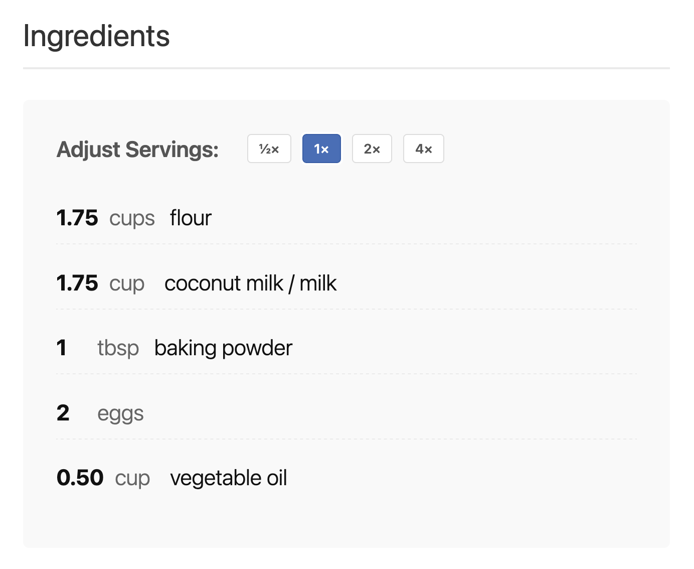

# Interactive Recipe Block

A modern WordPress recipe block that includes ingredient scaling via the WP Interactivity API.

## 🚀 Features

- **Interactive ingredient scaling** (½×, 1×, 2×, 4×) using the [WP Interactivity API](https://developer.wordpress.org/block-editor/reference-guides/packages/packages-interactivity/)
- Add recipe title, image, description, and notes
- List ingredients as individual blocks for easy editing
- 100% block editor (Gutenberg) compatible

## 🖼 Screenshots

## 🛠 Installation

1. Download or clone this repository to your `/wp-content/plugins/interactive-recipe-block` directory.
2. Run `npm install` and `npm run build` (or `npm start` for development) in the plugin directory.
3. Activate the plugin from the WordPress admin Plugins screen.
4. Add the **Interactive Recipe** block to any post or page using the block editor.

## ✨ Usage

- Add the **Interactive Recipe** block in the editor.
- Fill in the recipe info, add ingredients (each as a block), and publish.
- Readers can use the scaling controls to instantly adjust ingredient amounts for any number of servings.

## ⚡️ Powered by the WP Interactivity API

This plugin uses the new [WordPress Interactivity API](https://developer.wordpress.org/block-editor/reference-guides/packages/packages-interactivity/) for real-time ingredient scaling. No page reloads, no custom JavaScript required—just instant updates for your readers.

## 💡 Customization

- Units and ingredient names are freeform text fields for maximum flexibility.
- The block uses standard markup and CSS for easy theme integration.

## 🧑‍💻 Contributing

Pull requests and issues are welcome! To contribute:

1. Fork this repository
2. Create a new branch for your feature or fix
3. Make your changes and submit a pull request

## 📄 License

GPL-2.0-or-later.

---

**Interactive Recipe Block** — Modern, interactive recipes for WordPress, made easy. 